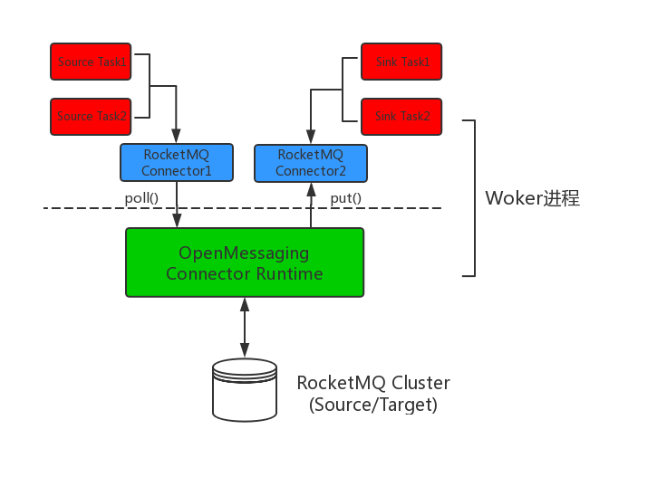

# 概要介绍

github展示md有点格式问题，最好用IDEA打开

在我的github上的connect代码是fork出来经过我二次开发的，底层原理可以看原github的材料，在我这里用途是Kafka和RocketMQ数据双向同步，它的完成度还是很高的，只是一些诸如启动端口等参数未开放出来，需要的可以自行二次开发，核心部分是高度可用的，经过了我的完整严苛测试，是准备上生产的代码。

简单理解RocketMQ Connect就是借RocketMQ从其他系统获取数据发送到RocketMQ，然后从RocketMQ消费消息写入到其他系统。主要由Source ，Sink ，Runtime组成。

Source 负责从其它系统获取数据，通过connect-runtime内置的Producer发送到RocketMQ
Sink 负责从rocketMQ上消费消息，将数据写入到kafka

Runtime是Source ，Sink的运行时环境，负责加载source和sink插件，提供RESTful接口，启动task任务，集群节点之间配置同步，消费进度保存，故障转移，负载均衡等能力。

如上图，sourceTask与sinkTask运行于runtime之上，source端透过poll()将外部系统消息拉到runtime上，再由runtime无缝发送到rocketMQ中。
而runtime会持续从rocketMQ消费消息，通过sinkTask的put方法进行消费将消息发送到kafka

source与sink基于插件的形式部署在指定目录由runtime加载运行，不同source与sink之间类加载器独立，共享runtime加载器作为父加载器
负载均衡

###服务发现
节点之间的互相发现基于向rocketMQ的同一cluster-topic注册成为消费者，透过消费组内成员个数监听，进而获取当前connect-runtime节点数量，节点上下线都可以透过消费组监听器动态感知
###负载均衡
正常情况下，各节点都拥有整个系统所有的task数据，然后各节点通过运行相同的一致性hash算法(减少任务抖动)获取分配给自己的task然后运行，并动态停止不属于自己的task
###配置同步和持久化
task配置信息变动，会透过内部的config-topic发送到rocketMQ，进而被各个节点消费达到各节点中配置信息的一致性，各节点定时会将本地缓存的配置信息持久化到文件中，重启节点会先加载本地文件
###位移同步和持久化
source和sink task的消息处理位移，会定时透过rocketMQ送往其他节点，其他节点收到位移信息后会与本地位移信息进行汇总处理，并定时持久化到本地文件，达到各节点最终一致性
###位移提交保证
sink task只会在消息从rocketMQ拉取并输出到kafka收到kafka的消息发送确认标识才会更新rocketMQ的消费位移，即只要输出到kafka失败，便会无限重试拉取消息重新投送kafka。
source task只会在消息从kafka拉取并输出到rocketMQ收到rocketMQ的消息发送确认标识才会更新kafka的消费位移，即只要输出到rocketMQ失败，便会无限重试拉取消息重新投送rocketMQ。
消息投递可能因为重试或者task分配变动导致重复，但理论上不会丢失，而本身MQ不保证消息只被投递一次但保证一定投递至少一次，所以由于connect造成的消息重复是无所谓的。
###任务并发数动态修改
透过rest运维接口，支持实时修改task的数量并实时生效，配合一致性hash算法最大程度降低task数量变动导致的任务启停抖动。

##connector-runtime
<b>Topic</b>
1. connector-cluster-topic
2. connector-config-topic
3. connector-offset-topic
4. connector-position-topic

<b>ConsumerGroup 手工无需参与,自动创建（通过内部调用mqClientAPIImpl）</b>
6. connector-consumer-group-${connectorName}
7. connector-cluster-group

修改/resource配置文件 connect.conf
workerId=CONNECTOR_WORKER_1  #本节点名称,各个worker之间必须唯一
storePathRootDir=E:/rocketmq-connect/storeRoot #本地持久化文件路径,保存偏移量和config信息(比如任务config)

<b>Http port for user to access REST API</b>

httpPort=8082 #rest运维地址

<b>Rocketmq namesrvAddr</b>

namesrvAddr=127.0.0.1:9876  #即connect进行同步的那个RocketMQ集群,同时也会作为connect节点内部信息交换的媒介通道

<b>RocketMQ acl 账号需要有admin的权限</b>

aclEnable=false
accessKey=rocketmq
secretKey=12345678

autoCreateGroupEnable=true #自动调用admin工具创建consumerGroup.如手工创建可设置为false,强烈建议设置为true,因为每个节点要创建的消费组不止上面2个

<b>sink和source插件的目录,注意每个sink和source都是独立的类加载器，所以sink和souce打包时如果有依赖需要用shade打成fat包</b>

pluginPaths=C:/Users/11722/.m2/repository/org/apache/rocketmq/rocketmq-connect-rocketmq/0.0.1-SNAPSHOT,C:/Users/11722/.m2/repository/org/apache/rocketmq/rocketmq-connect-kafka/0.0.1-SNAPSHOT

<b>启动java命令需携带JVM参数</b>
-c E:\idea_wp\rocketmq-connect\rocketmq-connect-runtime\src\main\resources\connect.conf

##rocketmq-connect-kafkaToRmq

###发送kafka消息到rocketMQ集群

在启动runtime之后，通过发送http消息到任意一台runtime机器，携带connector和task的参数，启动connector即可,task会自动分配轮询分配到其他runtime节点
kafka的consumerID固定为 : connector-consumer-group-${connectorName}

####参数说明
1. tasks.num: 启动的task数目,各task的配置完全相同，所以如果数量超过kafka分区数的话也没用
2. kafka.topics: kafka的topic列表,多个topic通过逗号“,”隔开。拉取消息后发到相同topic名称的rocketMQ集群中
3. kafka.bootstrap.server: kafka的broker地址
4. connector-class:org.apache.rocketmq.connect.kafka.connector.KafkaSourceConnector

新增Connector示例见

GET http://127.0.0.1:8082/connectors/create/kafkaSource?config={"tasks.num":"4","kafka.topics":"kafkaconnect","kafka.bootstrap.server":"127.0.0.1:9092","connector-class":"org.apache.rocketmq.connect.kafka.connector.KafkaSourceConnector"}

其中 127.0.0.1:8082 为runtime的任意一台机器,kafkaSource为connector的名称，connector名称需要唯一。

##rocketmq-connect-rmqToKafka

###发送rocketMQ消息到kafka集群

在启动runtime之后，通过发送http消息到任意一台runtime机器，携带connector和task的参数，启动connector即可,task会自动分配轮询分配到其他runtime节点
rocketMQ的consumerID固定为 : connector-consumer-group-${connectorName}

####参数说明
1. tasks.num: 启动的task数目,各task的配置完全相同，所以如果数量超过messageQueue的话也没用
2. rocketmq.topics: rocketMQ的topic列表,多个topic通过逗号“,”隔开。拉取消息后发到相同topic名称的kafka集群中
3. kafka.bootstrap.server: kafka的broker地址
4. connector-class:org.apache.rocketmq.connect.rocketmq.connector.RocketMQSinkConnector

新增Connector示例
GET http://127.0.0.1:8082/connectors/create/kafkaSink?config={"rocketmq.topics":"kafkaconnect","tasks.num":"2","kafka.bootstrap.server":"127.0.0.1:9092","connector-class":"org.apache.rocketmq.connect.rocketmq.connector.RocketMQSinkConnector"}

其中 127.0.0.1:8082 为runtime的任意一台机器,kafkaSink 为connector的名称，connector名称需要全局唯一。

##使用理念

rocketMQ和kafka的消费组名称格式为：connector-consumer-group-${connectorName}
1. 目前设计理念是，一个connectorName对应一个topic，该connector用来同步自己的topic。N个connector组共同协作合并同步整个MQ集群。connector自己组内可以拆出来N个Task用来拉取同一个topic的消息，通过taskNum控制组内task的数量调整并发度。

2. 位移同步和持久化都是以topic为维度，而不是消费组的维度。

##运维命令

 //查看全部connector config以及对应的task config 

app.get("/getConnectorTask", this::getConnectorTask);

//查看全部connector config 

app.get("/getConnectors", this::getAllConnectors);

//查看单个connector config 

app.get("/getConnectors/:connectorName", this::getConnectors);

//查看指定connector的配置信息 

app.get("/getConnectorTask/:connectorName", this::handleQueryConnectorConfig);

//查看指定connector状态,启用或者禁用或者删除状态 

app.get("/getConnectorsStatus/:connectorName", this::handleQueryConnectorStatus);

//动态开启message消息log打印或者关闭打印

app.get("/logMsgDetail/:trueOrFalse", this::handleLogMsg);

//查看集群信息

app.get("/getClusterInfo", this::getClusterInfo);

//查看分配给自己的任务的状态

app.get("/getAllocatedTask", this::getAllocatedTask);

//查看所有task的状态，内部会调用其他节点的getAllocatedTask .":byWorker"为true或false,决定展示方式

app.get("/getAllTask/:byWorker", this::getAllTask);

//插件重新加载,如果增加了新的插件,调用这个方法可以热刷新

app.get("/plugin/reload", this::reloadPlugins);

//新增connector

app.get("/connectors/create/:connectorName", this::handleCreateConnector);

//修改connector,可只传入需要修改的参数部分,内部直接覆盖原配置

app.get("/connectors/update/:connectorName", this::handleUpdateConnector);

//调整task数量,taskNum为目标任务数量

app.get("/connectors/taskNum/:connectorName/:taskNum", this::handleTaskNum);

//启用

app.get("/connectors/all/enable", this::handleEnableAllConnector);

//暂时禁用,配置文件读出来也不会去执行,同时停止该connector对应的Task. task的stop是通过把connector禁用，这样maintainTaskStat时候就不会分配该task，达到维护task的目的

app.get("/connectors/all/disable", this::handleDisableAllConnector);

//删除

app.get("/connectors/all/remove", this::handleRemoveAllConnector);

//启用

app.get("/connectors/single/:connectorName/enable", this::handleEnableConnector);

//暂时禁用,配置文件读出来也不会去执行,同时停止该connector对应的Task

app.get("/connectors/single/:connectorName/disable", this::handleDisableConnector);

//删除

app.get("/connectors/single/:connectorName/remove", this::handleRemoveConnector);

源代码查看某个被引入的类来源是哪里，不然经常报class找不到
 
org.reflections.scanners.AbstractScanner#put
